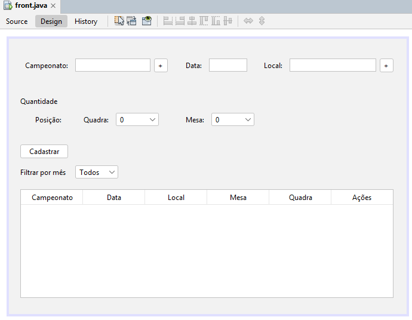
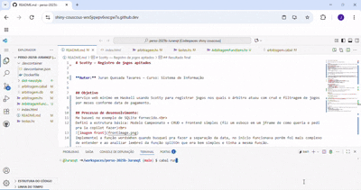

# Scotty — Registro de jogos apitados


**Autor:** Juran Quesada Tavares — Curso: Sistema de Informação


## Objetivo
Serviço web mínimo em Haskell usando Scotty para registrar jogos nos quais o árbitro atuou com crud e filtragem de jogos por meses conforme data de pagamento.

## Processo de desenvolvimento:
Me baseei no exemplo de SQLite fornecido.<br>
Defini a estrutura básica: Modelo Campeonato + CRUD + Frontend simples (fiz um esboço em um jframe de como queria e pedi pra ia copilot fazer)<br>

Implementei a função wordsWhen quando busquei pra fazer a separação da data, no inicio funcionava porém foi mais complexo de entender e ao analizar lembrei da função splitOn que era bem simples e tinha a mesma função.
```
wordsWhen p s = case dropWhile p s of
  "" -> []
  s' -> w : wordsWhen p s'' where (w, s'') = break p s'
```

Tive dificuldades para fazer o html aparecer na página principal, mas ao pesquisar vi que tinha que fazer a requisição HTTP do get pro caminho raiz e enviar o arquivo index.html  
```
get "/" $ file "index.html"
```

O filtro por mês dos campeonatos não funcionava corretamente e sempre retornava uma lista vazia (`[]`).<br>
O problema estava na comparação das datas: o código tava montando as datas no formato `dia-mes-ano`.<br>
A solução foi montar as datas no formato `YYYY-MM-DD` (ano-mês-dia), permitindo a comparação correta e o funcionamento do filtro por intervalo de pagamento.


## Endpoints principais

- `GET /campeonatos` — lista campeonatos
- `POST /campeonatos` — cria um campeonato (`{ "nome": "Copa 2025" }`)
- `GET /campeonatos/mes/:mes` — lista campeonatos filtrados pelo mês de pagamento
- `GET /jogos` — lista todos os jogos
- `POST /jogos` — registra um jogo (JSON com os campos do `Jogo`)
- `GET /jogos/:campeonato` — lista jogos de um campeonato


## Como executar (Codespaces)
1. Abra o Codespace a partir do repositório.
2. No terminal do Codespace, execute:
	- `cabal update`
	- `cabal install --only-dependencies --overwrite-policy=always`
3. Para rodar o servidor: `cabal run`
4. Para rodar os testes: `cabal test`

## Resultado final

Adicione aqui um GIF ou vídeo curto (máx. 60s) mostrando o funcionamento do sistema:




## Exemplos (curl)
```bash
# criar campeonato
curl -X POST -H "Content-Type: application/json" -d '{"nome":"Copa 2025"}' http://localhost:3000/campeonatos


# listar campeonatos
curl http://localhost:3000/campeonatos


# registrar campeonato
curl -X POST -H "Content-Type: application/json" -d '{"campeonato":"Copa 2025","dataCampo":"2025-09-22","local":"Ginásio Central","mesa":"1","quadra":"2"}' http://localhost:3000/campeonatos


# buscar campeonatos por mês
curl http://localhost:3000/campeonatos/mes/9
```

## Referências

- [Exemplo SQLite](https://liascript.github.io/course/?https://raw.githubusercontent.com/elc117/demo-scotty-codespace-2025b/main/README.md#8)
- [Scotty](https://hackage.haskell.org/package/scotty-0.22/docs/Web-Scotty.html)
- [sqlite-simple](https://hackage.haskell.org/package/sqlite-simple-0.4.19.0/docs/Database-SQLite-Simple.html)
- [HUnit](https://hackage.haskell.org/package/HUnit-1.6.2.0/docs/Test-HUnit.html)
- [split](https://hackage.haskell.org/package/split-0.2.5/docs/Data-List-Split.html)
- [GitHub Copilot](https://github.com/features/copilot)
- [BLACKBOX.AI](https://www.blackbox.ai/)
- [Documentação do Cabal](https://cabal.readthedocs.io/en/stable/index.html)


## Créditos e IA

Este projeto utilizou o GitHub Copilot e o BLACKBOX.AI para geração de código, sugestões de estrutura e solução de problemas.
Alguns prompts usados:
- "Como filtrar datas por mês em Haskell?"
- "Faça um arquivo html para ficar neste estilo (imagem)"
- "Como servir um arquivo HTML com Scotty?"

Referências externas e IA foram fundamentais para acelerar o desenvolvimento, depuração e compreensão.

